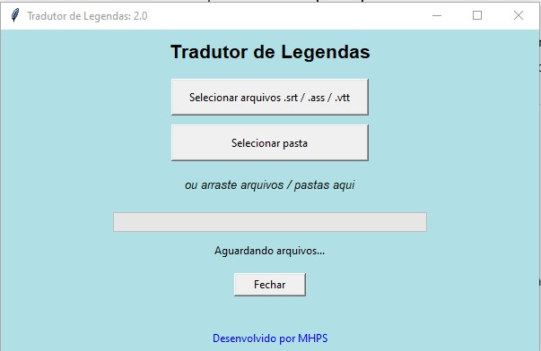

# 🎬 Tradutor de Legendas


Aplicação desktop em Python para tradução automática de legendas com interface gráfica, suporte a **`.srt`**, **`.ass`** e **`.vtt`**, tradução em lote, arrastar e soltar arquivos ou pastas, barra de progresso e limpeza automática de elementos indesejados da legenda.

---

## 🖥️ Interface



---

## ✨ Recursos

- Tradução automática via **Google Translate** usando `deep-translator`
- Suporte a **`.srt`**, **`.ass`** e **`.vtt`**
- Tradução em lote de **múltiplos arquivos**
- Tradução de **pastas inteiras**
- Suporte a **drag and drop** de arquivos e pastas
- Barra de progresso durante o processamento
- Geração automática da pasta **`traduzido`**
- Mantém o **mesmo nome do arquivo original**
- Interface simples e direta
- Compatível com geração de executável `.exe`

---

## 🧹 Limpeza automática antes da tradução

O programa remove automaticamente elementos comuns que atrapalham a tradução ou deixam a legenda poluída, como:

- textos entre colchetes: `[birds chirping]`
- textos entre parênteses: `(laughing)`
- textos entre chaves: `{comment}`
- tags HTML: `<i>texto</i>`, `<font color="red">`
- símbolos musicais: `♪`, `♫`, `♬`

Exemplo:

```text
♪ Music playing ♪
<i>Hello</i>
Oh God, this [beep] hurts (laughing)
```

Resultado processado:

```text
Hello
Oh God, this hurts
```

---

## 📂 Como funciona

Ao selecionar arquivos ou arrastar uma pasta para a interface, o programa:

1. identifica os arquivos de legenda compatíveis
2. limpa trechos indesejados
3. divide o conteúdo em blocos seguros para tradução
4. traduz automaticamente
5. salva o resultado em uma subpasta chamada **`traduzido`**

Exemplo de saída:

```text
pasta_original/
├── episodio01.srt
├── episodio02.ass
├── episodio03.vtt
└── traduzido/
    ├── episodio01.srt
    ├── episodio02.ass
    └── episodio03.vtt
```

Os arquivos originais **não são modificados**.

---

## 📦 Instalação

Clone o repositório:

```bash
git clone https://github.com/AleCaderudo/tradutor-legendas.git
cd tradutor-legendas
```

Crie o ambiente virtual:

```bash
python -m venv .venv
```

Ative o ambiente virtual no Windows:

```bash
.venv\Scripts\activate
```

Instale as dependências:

```bash
pip install -r requirements.txt
```

---

## ▶️ Como executar

```bash
python Tr.py
```

---

## 🏗️ Gerar executável (.exe)

Instale o PyInstaller:

```bash
pip install pyinstaller
```

Gere o executável:

```bash
pyinstaller --onefile --windowed --name TradutorLegendas Tr.py
```

O arquivo final será criado em:

```text
dist/TradutorLegendas.exe
```

---

## 📁 Estrutura do projeto

```text
tradutor-legendas/
├── Tr.py
├── tradutor.py
├── requirements.txt
├── print_tela.jpg
└── README.md
```

---

## 📚 Dependências

- `deep-translator==1.11.4`
- `pysrt==1.1.2`
- `tkinterdnd2`
- `tkinter` (já incluso no Python)

---

## ⚠️ Observações

- Requer conexão com a internet
- A tradução depende da disponibilidade do Google Translate
- O limite por requisição é tratado internamente pelo programa
- O projeto foi pensado para uso pessoal e educacional

---

## 👨‍💻 Desenvolvido por

**MHPS**  
Site: https://www.mhps.com.br

---

## 📜 Licença

Este projeto é disponibilizado para **uso pessoal e educacional**.

Para uso comercial, verifique os termos de uso dos serviços de tradução utilizados.
